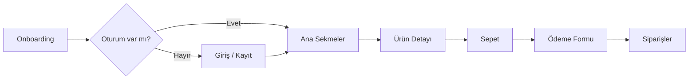
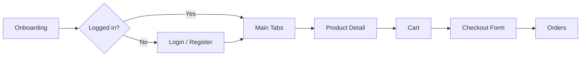

<div align="center">

# ShopApp

Expo + React Native ile geliştirilmiş, TypeScript tabanlı bir e-ticaret mobil uygulaması.


<a id="top"></a>

<p>
  <a href="#turkce"><b>🇹🇷 Türkçe</b></a>
  &nbsp;|&nbsp;
  <a href="#english"><b>🇬🇧 English</b></a>
</p>

</div>

---

<a id="turkce"></a>

## 🇹🇷 Türkçe

Ürün listeleme, arama/filtreleme, sepet, ödeme formu, sipariş takibi, kullanıcı girişi, çoklu dil ve tema desteği gibi gerçek bir alışveriş uygulamasının temel akışlarını içerir.

### Uygulama Akışı



### Özellikler

- **Onboarding & Auth** — İlk açılışta tanıtım ekranları, e-posta/şifre ile giriş-kayıt akışı; oturum token'ı `expo-secure-store` içinde saklanır.
- **Ürün Listeleme & Detay** — Kategoriye göre filtreleme, sıralama (ucuzdan pahalıya, indirimli vb.), arama çubuğu, ürün detay sayfasında özellikler ve kullanıcı yorumları/puanları.
- **Sepet** — Zustand ile yönetilen sepet state'i, adet artır/azalt, toplam tutar ve kargo bedeli hesaplama; sepet cihazda kalıcı olarak saklanır ve offline'da da çalışır.
- **Ödeme Formu** — React Hook Form + Zod ile doğrulanan kart ve adres bilgisi formu.
- **Siparişler** — Geçmiş siparişler ve sipariş durumu takibi (beklemede, kargoda, teslim edildi vb.).
- **Profil** — Tema ve dil tercihleri, hesap bilgileri.
- **Karanlık / Aydınlık Tema** — Sistem temasını takip edebilen ya da elle seçilebilen tema desteği.
- **Çoklu Dil (i18n)** — Türkçe ve İngilizce dil desteği (`i18next` / `react-i18next`).
- **Offline-First** — Bağlantı durumunu izleyen banner ve `TanStack Query`'nin `offlineFirst` modu ile önbellekten çalışabilme.
- **Erişilebilirlik** — Etkileşimli bileşenlerde `accessibilityLabel` / `accessibilityLiveRegion` desteği.
- **Skeleton Loading** — `Reanimated` + `expo-linear-gradient` ile shimmer efektli yükleme durumları.

### Teknolojiler

| Katman | Kullanılan Teknoloji |
| --- | --- |
| Framework | Expo (SDK 54), React Native 0.81, React 19 |
| Dil | TypeScript |
| Yönlendirme | Expo Router (file-based routing, typed routes) |
| State Yönetimi | Zustand (persist middleware ile AsyncStorage) |
| Sunucu State / Veri Çekme | TanStack Query, Axios, Apollo Client (GraphQL) |
| Form & Doğrulama | React Hook Form, Zod |
| Animasyon | React Native Reanimated, Gesture Handler |
| Depolama | AsyncStorage (kalıcı state), SecureStore (oturum token'ı) |
| Diğer Native Modüller | expo-image, expo-image-picker, expo-notifications, expo-localization, NetInfo |

### Proje Yapısı

```
ShopApp/
├── app/                  # Expo Router ekranları (file-based routing)
│   ├── (auth)/           # Giriş / kayıt akışı
│   ├── (tabs)/           # Ana sekmeler: anasayfa, sepet, siparişler, profil
│   ├── urun/[id].tsx     # Ürün detay sayfası
│   └── onboarding.tsx    # İlk açılış tanıtım ekranları
├── components/           # Yeniden kullanılabilir UI bileşenleri
├── constants/            # Tema, mock veri ve sabitler
├── hooks/                # Tema, bağlantı durumu, veri çekme gibi custom hook'lar
├── i18n/                 # Dil dosyaları (tr / en)
├── services/             # API istemcileri (Axios, Apollo)
├── store/                # Zustand store'ları (sepet, auth, favoriler, tema)
└── types/                # Ortak TypeScript tip tanımları
```

### Kurulum

```bash
# Bağımlılıkları yükle
npm install

# Geliştirme sunucusunu başlat
npx expo start
```

Açılan terminalden aşağıdaki seçeneklerden biriyle uygulamayı çalıştırabilirsin:

- [Development build](https://docs.expo.dev/develop/development-builds/introduction/)
- Android emulator
- iOS simulator
- [Expo Go](https://expo.dev/go)

### Kullanılabilir Komutlar

| Komut | Açıklama |
| --- | --- |
| `npm run start` | Expo geliştirme sunucusunu başlatır |
| `npm run android` | Android emulator/cihazda çalıştırır |
| `npm run ios` | iOS simulator/cihazda çalıştırır |
| `npm run web` | Web'de çalıştırır |
| `npm run lint` | ESLint ile kod kontrolü yapar |

### Not

Bu proje, kişisel bir React Native öğrenme sürecinin final projesi olarak geliştirilmiştir.

<p align="right"><a href="#top">↑ başa dön</a></p>

---

<a id="english"></a>

## 🇬🇧 English

A TypeScript-based e-commerce mobile app built with Expo + React Native. It covers the core flows of a real shopping app: product listing, cart, checkout, order tracking, authentication, multi-language and theme support.

### App Flow



### Features

- **Onboarding & Auth** — Intro screens on first launch, email/password login-register flow; session token stored in `expo-secure-store`.
- **Product Listing & Detail** — Category filtering, sorting (price low-to-high, discounted only, etc.), search bar, product detail page with specs and user reviews/ratings.
- **Cart** — Cart state managed with Zustand, quantity increment/decrement, total price and shipping cost calculation; cart persists on device and works offline.
- **Checkout Form** — Card and address form validated with React Hook Form + Zod.
- **Orders** — Order history and status tracking (pending, shipped, delivered, etc.).
- **Profile** — Theme and language preferences, account info.
- **Dark / Light Theme** — Follows system theme or can be set manually.
- **Multi-language (i18n)** — Turkish and English support (`i18next` / `react-i18next`).
- **Offline-First** — Connectivity banner and `TanStack Query`'s `offlineFirst` mode to keep working from cache.
- **Accessibility** — `accessibilityLabel` / `accessibilityLiveRegion` support on interactive components.
- **Skeleton Loading** — Shimmer effect loading states using `Reanimated` + `expo-linear-gradient`.

### Tech Stack

| Layer | Technology |
| --- | --- |
| Framework | Expo (SDK 54), React Native 0.81, React 19 |
| Language | TypeScript |
| Routing | Expo Router (file-based routing, typed routes) |
| State Management | Zustand (persist middleware with AsyncStorage) |
| Server State / Data Fetching | TanStack Query, Axios, Apollo Client (GraphQL) |
| Forms & Validation | React Hook Form, Zod |
| Animation | React Native Reanimated, Gesture Handler |
| Storage | AsyncStorage (persisted state), SecureStore (session token) |
| Other Native Modules | expo-image, expo-image-picker, expo-notifications, expo-localization, NetInfo |

### Project Structure

```
ShopApp/
├── app/                  # Expo Router screens (file-based routing)
│   ├── (auth)/           # Login / register flow
│   ├── (tabs)/           # Main tabs: home, cart, orders, profile
│   ├── urun/[id].tsx     # Product detail page
│   └── onboarding.tsx    # First-launch intro screens
├── components/           # Reusable UI components
├── constants/            # Theme, mock data and constants
├── hooks/                # Custom hooks for theme, connectivity, data fetching
├── i18n/                 # Language files (tr / en)
├── services/             # API clients (Axios, Apollo)
├── store/                # Zustand stores (cart, auth, favorites, theme)
└── types/                # Shared TypeScript type definitions
```

### Getting Started

```bash
# Install dependencies
npm install

# Start the development server
npx expo start
```

From the output, you can run the app using:

- [Development build](https://docs.expo.dev/develop/development-builds/introduction/)
- Android emulator
- iOS simulator
- [Expo Go](https://expo.dev/go)

### Available Scripts

| Command | Description |
| --- | --- |
| `npm run start` | Starts the Expo development server |
| `npm run android` | Runs on an Android emulator/device |
| `npm run ios` | Runs on an iOS simulator/device |
| `npm run web` | Runs on the web |
| `npm run lint` | Runs ESLint checks |

### Note

This project was built as the capstone project of a personal React Native learning journey.

<p align="right"><a href="#top">↑ back to top</a></p>
